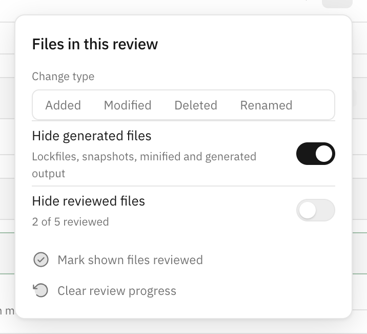
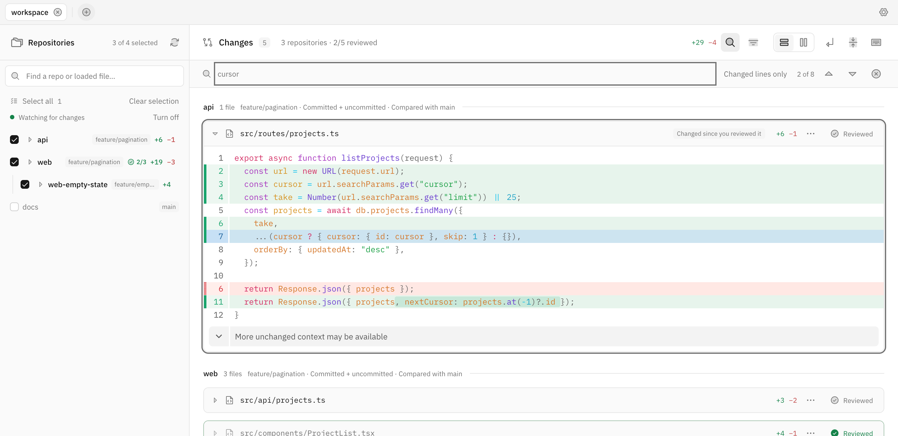
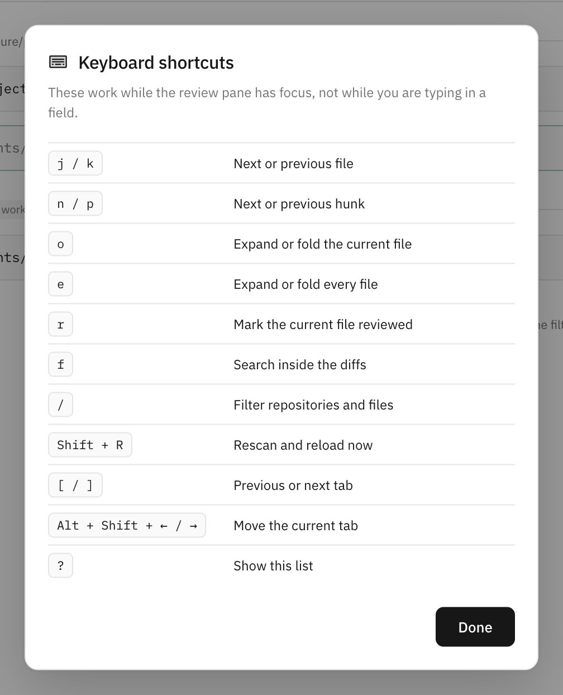
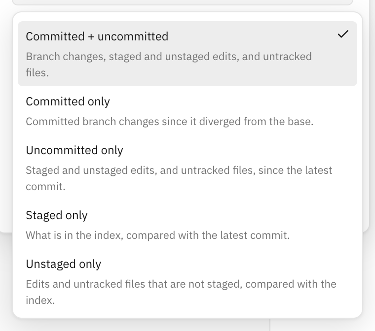

# Using polydiff

[Back to the README](../README.md)

## Tabs

Work is organised into tabs. The `+` button opens the operating system's own folder chooser (`osascript` on macOS, `zenity` or `kdialog` on Linux, a PowerShell folder dialog on Windows) and always opens a new tab, so the same directory can be open several times with different repositories and comparisons in each. Right-click a tab for duplicate, rename, and move actions. Running `polydiff <directory>` reuses a tab already open on that directory instead of adding another.

A tab is named after its folder until you give it one of your own; double-click the tab or use Rename tab, and Reset name puts the folder name back. The folder path is always in the tab's tooltip. Drag a tab to reorder it, or use Move left and Move right in its menu; the order is saved.

Closing a tab keeps it in a list of the ten most recently closed. The restore button at the right of the tab bar brings the last one back with its settings intact.

## Settings and stored state

Settings apply everywhere and cover appearance (theme, unified or split, line wrapping, sidebar density and width), refreshing (whether selected repositories reload on their own), diffs (within-line highlighting, context lines per expansion), opening files (which editor the file menu hands a path to), and discovery (search depth, directory budget, and folder names to skip). Discovery settings take effect on the next rescan. Each tab separately remembers its directory, its name, and any repository whose base branch, comparison branch, tick, or reviewed files you changed.

New tabs start with no repositories selected. Every discovered repository appears in the sidebar, and ticking one loads its changes and opens its file list. Unticking it cancels its pending diff request and removes it from the review. Saved selections are restored when you reopen a tab; newly discovered repositories remain unticked. Comparison branches are kept for unticked repositories. Search matches repository names and loaded changed files.

Repositories in the review are listed first, then the rest, each group in alphabetical order. A linked worktree sorts under the repository it belongs to and is indented beneath it; each row shows the branch that is checked out there. The review pane follows the same order. Select matching ticks every repository the search is showing, and Clear selection unticks everything.

Skip these folders shows the full default list. Remove a name to include that folder in discovery, or add a folder name to skip it. Reset preferences restores all app defaults, including this list and the sidebar width, while keeping open tabs, recently closed tabs, and repository comparisons.

Drag the sidebar's right edge to resize it. You can also focus the divider and use Left/Right to adjust its width, or Home/End for the minimum/maximum. The width is saved across sessions. Long file and directory names scroll horizontally within each repository tree.

Repositories in the sidebar and files in the review pane both open folded. Clicking a file in the sidebar expands that file and scrolls to it, and the toolbar button expands or folds every file at once.

Search text, which files are expanded, and scroll position are deliberately not stored, because restoring them is more surprising than retyping them. Which files you have reviewed is stored, because losing that is worse than restoring it.

State lives in `~/.polydiff/db.json`, written atomically and debounced; set `POLYDIFF_HOME` to store it elsewhere. Only values that differ from the defaults are written, so the file stays readable. A file that cannot be parsed is moved aside to `db.json.corrupt` and a fresh one is started. Files written by an earlier version are migrated when loaded and saved in the current format on the next write.

```json
{
  "version": 6,
  "revision": 48,
  "settings": { "layout": "split" },
  "activeTab": "tmu0as73o",
  "tabs": [
    {
      "id": "tmu0as73o",
      "root": "/Users/you/Developer/netlify",
      "name": "API migration",
      "repos": {
        "/Users/you/Developer/netlify/build": {
          "target": "release",
          "selected": true,
          "reviewed": { "src/index.ts": "1f4pq2" }
        }
      }
    }
  ],
  "recent": []
}
```

A reviewed file is stored against a short value standing for the diff you read, so the same file counts as reviewed only until it changes again. Up to 2000 files are kept per repository, and paths that leave a comparison are dropped the next time it loads.

The browser sends one command per change rather than the whole document, and the server applies it to whatever is on disk. Repository settings merge, so a repository missing from the latest scan keeps what you gave it, including its selection, and two windows editing different tabs do not overwrite each other.

Version 6 adds tab names, tab order, and reviewed files. Nothing is discarded when a version 5 file is read: tabs keep the order they were stored in and start with no name.

Version 5 removes automatic selection rules. Migration preserves explicit selections and comparison branches in open and recently closed tabs; repositories previously included only by Changed or All now start unticked. Before version 4, ticks only applied in custom mode (or version 1), so inactive ticks from other modes are discarded.

## Refreshing

While a tab is in front of you, its selected repositories are checked every few seconds and reloaded when something moves. The check asks the server for one short value per repository that stands for what the comparison would show: the commits at each end, and for comparisons that read local files, the output of `git status` together with the timestamp and size of every file it names. Only a repository whose value changed is reloaded, so nothing happens while you read.

The status line under the sidebar's search box says what the watcher is doing, and turns it off and on. A background tab or a hidden window pauses it, and so does a scan. A check that fails is not reported; the next one retries. Files you have expanded and the reviewed marks survive a reload, and the diff viewer holds your scroll position against the change in height.

Files carry a Reviewed toggle. Marking one folds it and counts it in the toolbar; the mark is tied to the diff you read, so the file comes back with a "Changed since you reviewed it" badge once it changes. The filter menu hides reviewed files, marks everything on screen as reviewed, and clears the marks again.

## Filtering and searching

The sidebar's search box matches repository names and the paths of loaded files, and what it leaves applies to the review pane as well. The filter menu in the toolbar narrows that further by change type, hides generated files (lockfiles, snapshots, minified output, and paths under `generated/`), and hides files you have reviewed. Each repository's heading says how many of its files a filter is hiding.



Search inside the diffs with the toolbar's magnifier or `f`. It looks through the loaded diffs of every repository in the review, counts the matches, and moves between them with Enter, Shift+Enter, or the arrows next to the count. Changed lines only leaves context lines out. Jumping to a match opens its file and scrolls to the line.



## Keyboard shortcuts

Press `?` for this list in the app. Shortcuts are ignored while you are typing in a field.



| Keys                     | Action                          |
| ------------------------ | ------------------------------- |
| `j` / `k`                | Next or previous file           |
| `n` / `p`                | Next or previous hunk           |
| `o`                      | Expand or fold the current file |
| `e`                      | Expand or fold every file       |
| `r`                      | Mark the current file reviewed  |
| `f`                      | Search inside the diffs         |
| `/`                      | Filter repositories and files   |
| `Shift` + `R`            | Rescan and reload now           |
| `[` / `]`                | Previous or next tab            |
| `Alt` + `Shift` + arrows | Move the current tab            |
| `?`                      | Show the shortcut list          |

## Copying and opening files

Each file's menu copies its path relative to its repository or its full path, and opens it in your editor at the first changed line. The editor is chosen in Settings, and the app hands the path to that editor's own URL scheme (`vscode://`, `cursor://`, `windsurf://`, `zed://`, `jetbrains://`, or `subl://`), so your browser asks before handing it over and the server never runs anything. Choose No editor to drop that menu item.

## Comparisons

Select and expand a repository to show its comparison button above the file list. Branch comparisons show the review branch versus the base, with “Includes uncommitted edits” or “Committed only” underneath. Local-only review shows “Uncommitted changes.” Unselected and folded repositories hide this control; the main review pane keeps the full comparison summary. Click the button and choose **Changes** first:

- **Committed + uncommitted** (default) includes committed changes since the current branch diverged from the base, staged and unstaged edits as their combined current content, and untracked files. The review branch is the current checkout; you can choose the base branch.
- **Committed only** shows committed changes since the review branch diverged from the base. You can choose any local or remote review branch and base branch. Local edits are excluded.
- **Uncommitted only** compares local files with the latest commit of the current checkout. It includes staged and unstaged edits as their combined current content, and untracked files. Both branch pickers are hidden; the saved base is restored when you switch back to a branch comparison.
- **Staged only** shows what is in the index, compared with the latest commit. Untracked files are not in it.
- **Unstaged only** compares the files on disk with the index, so it shows edits you have not staged, plus untracked files.



The review branch picker accepts a tag or a commit as well as a branch: type a revision into its search box and it is offered as an option. Whatever you choose is passed to Git as written, so it has to be a revision the repository already has.

Switching from committed review of another branch to a scope containing uncommitted edits switches the review to the current checkout. Switching back to committed review starts with that checkout; choose another review branch if needed. Existing saved comparisons retain their meaning. No checkout, fetch, staging, or file edits are performed.

The base defaults to origin's default branch when available, then main/master, then HEAD. You can override it per repository. Remote branches reflect the refs already present locally.

Discovery handles `.git` directories and worktree `.git` files, searches eight directory levels and 10,000 directories by default, and does not follow directory symlinks. Inside repositories it also checks `.worktrees`.

Discovery stops at each repository boundary and never walks a repository's contents, so it only traverses the space between repositories. No `.gitignore` applies there, and none is read; dependency, virtualenv, and cache directory names are skipped by default, and Settings can add or remove names. Build output names such as `build`, `dist`, and `target` are deliberately not on the default list, because they are also ordinary repository names. Reaching either search limit reports one summary warning rather than one per directory, naming the setting that raises it.

Binary files carry a Binary badge and a note in place of their contents, and a file whose mode changed shows the old and new modes. Untracked files larger than 1 MB and untracked symlinks are skipped with a warning that names the file; an untracked directory that is itself a repository is skipped quietly, because it has its own row. Git output is limited to 16 MB per command. A repository without commits compares against Git's empty tree, so everything in it reads as new, with a notice saying so.

The server binds to loopback on an available port and requires a per-session token for API requests. `POST` is accepted only for state commands. The browser uses the local server to read directories; nothing is uploaded.

Syntax highlighting runs in a worker pool and diffs are virtualised, so only visible content is rendered. Expanding hidden context loads the whole file once and caches it, so the first expansion in a file is slower than the rest.
